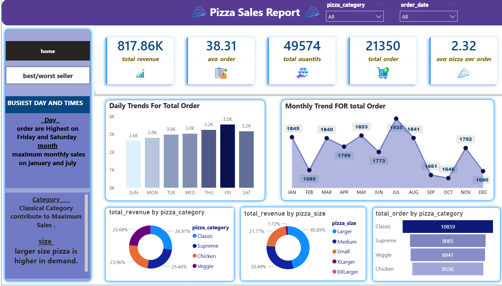

# Pizza Sales Dashboard - Power BI

**Tools:** Power BI Desktop, Excel, DAX

**About:** 
Pizza sales data ka interactive dashboard. Revenue, orders, best/worst pizza ka analysis kiya hai.

**Key KPIs from Dashboard:**
- Total Revenue: 817.86K
- Avg Order: 38.31 
- Total Quantity: 49,574

**Key Insights:**
1. Best seller: THAI CHICKEN PIZZA - maximum revenue
2. Worst seller: Brie Carre - minimum revenue 
3. Busiest days: Friday & Saturday
4. Top category: Classic - max quantity & orders

### Dashboard Preview

**How to use:** `.pbix` file ko Power BI Desktop me open karo
